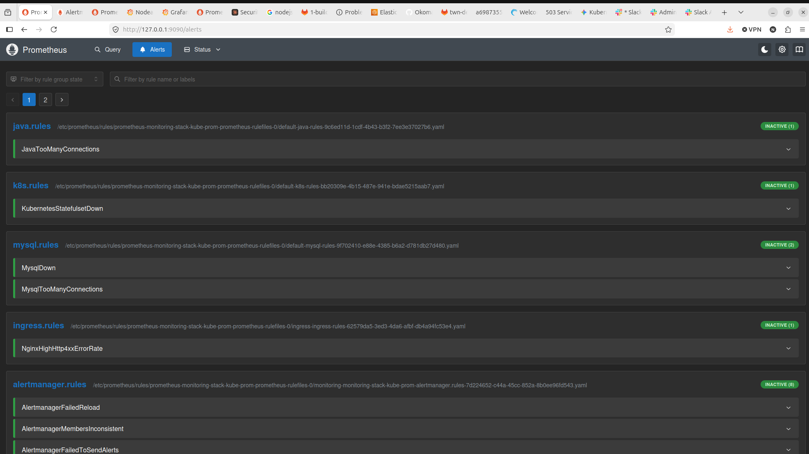
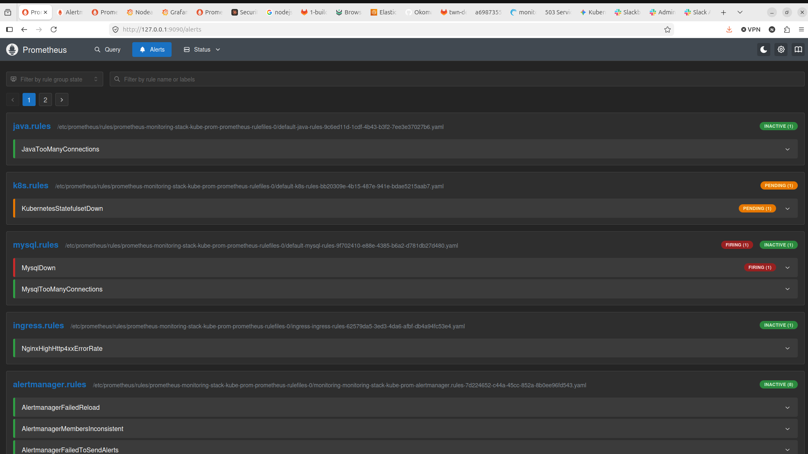
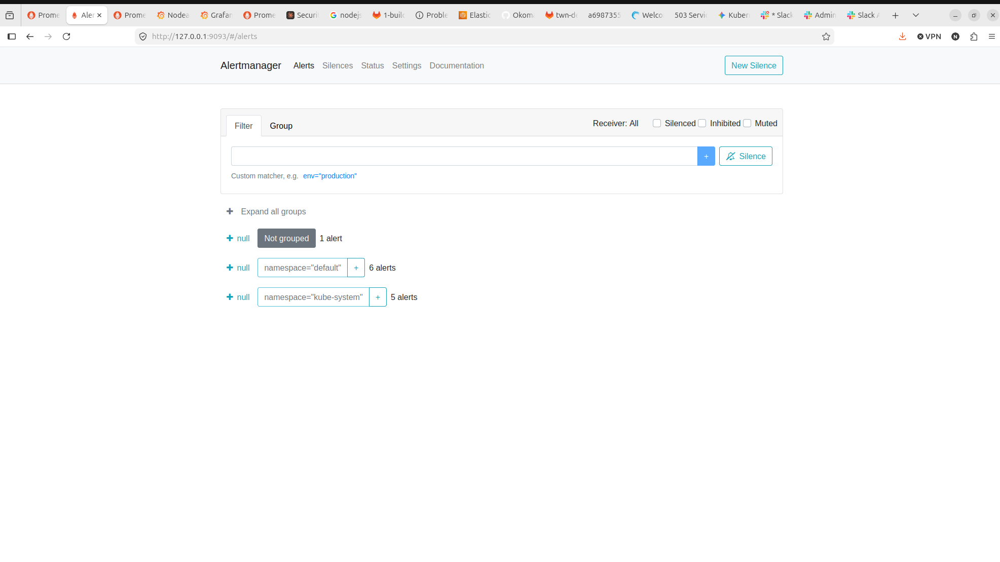

# Kubernetes Monitoring with Prometheus — Production-Grade Observability Stack

> **Author:** Senior DevOps Engineer
> **Platform:** Linode Kubernetes Engine (LKE)
> **Stack:** Prometheus · Alertmanager · Grafana · nginx-ingress · MySQL · Java Spring Boot

---

## Table of Contents

1. [Project Overview](#1-project-overview)
2. [Why This Matters](#2-why-this-matters)
3. [Architecture](#3-architecture)
4. [Prerequisites](#4-prerequisites)
5. [Project Structure](#5-project-structure)
6. [Exercise 1 — Deploy the Application Stack](#6-exercise-1--deploy-the-application-stack)
7. [Exercise 2 — Deploy Prometheus Monitoring Stack](#7-exercise-2--deploy-prometheus-monitoring-stack)
8. [Exercise 3 — Configure Alert Rules](#8-exercise-3--configure-alert-rules)
9. [Exercise 4 — Configure Alertmanager Notifications](#9-exercise-4--configure-alertmanager-notifications)
10. [Exercise 5 — Trigger and Test Alerts](#10-exercise-5--trigger-and-test-alerts)
11. [Known Issues and Resolutions](#11-known-issues-and-resolutions)
12. [Key Lessons Learned](#12-key-lessons-learned)

---

## 1. Project Overview

This project implements a **production-grade Kubernetes monitoring solution** on Linode Kubernetes Engine (LKE) using the Prometheus ecosystem. It covers the full observability lifecycle — from metric collection, to rule-based alerting, to multi-channel notification delivery via Slack and email.

The monitored application stack consists of:
- A **Java Spring Boot** web application with Prometheus metrics instrumentation
- A **MySQL 8.4** database (StatefulSet with persistent storage)
- An **nginx ingress controller** serving as the entry point for HTTP traffic

---

## 2. Why This Matters

In modern cloud-native environments, **reactive operations are not enough**. Teams need proactive observability to detect failures before they impact end users. This project demonstrates:

| Concern | Solution |
|---|---|
| Application availability | `mysql_up`, Java request metrics, nginx error rate |
| Infrastructure health | Kubernetes StatefulSet ready replica ratio |
| Alerting fatigue reduction | Severity-based routing (critical → Slack, infra → email) |
| Secret management | Kubernetes Secrets for credentials, file-based auth in Alertmanager |
| GitOps-ready configuration | All manifests version-controlled, Helm values as code |

Without monitoring:
- Database outages are discovered by end users, not the engineering team
- Cascading failures go undetected until the entire stack is down
- Post-incident analysis lacks the metrics data needed for root cause analysis

---

## 3. Architecture

```
┌─────────────────────────────────────────────────────────────────────┐
│                    Linode Kubernetes Engine (LKE)                    │
│                                                                      │
│  ┌─────────────── namespace: ingress ────────────────┐              │
│  │                                                    │              │
│  │   ┌─────────────────────────────────────────┐     │              │
│  │   │     nginx Ingress Controller             │     │              │
│  │   │     (LoadBalancer: 172.105.12.116)       │◄────┼── Internet  │
│  │   │     Metrics port: 10254                  │     │              │
│  │   └──────────────────┬──────────────────────┘     │              │
│  └─────────────────────┼───────────────────────────── ┘              │
│                        │                                             │
│  ┌─────────────── namespace: default ────────────────┐              │
│  │                     │                              │              │
│  │   ┌─────────────────▼──────────────────────┐      │              │
│  │   │       Java Spring Boot App (x3)         │      │              │
│  │   │       Port 8080 (app) / 8081 (metrics)  │      │              │
│  │   └─────────────────┬──────────────────────┘      │              │
│  │                     │ SQL                          │              │
│  │   ┌─────────────────▼──────────────────────┐      │              │
│  │   │       MySQL 8.4 StatefulSet             │      │              │
│  │   │       Port 3306  │  PVC: 8Gi            │      │              │
│  │   └──────────────────┼─────────────────────┘      │              │
│  │                      │                             │              │
│  │   ┌──────────────────▼─────────────────────┐      │              │
│  │   │       MySQL Exporter (Deployment)       │      │              │
│  │   │       Port 9104 /metrics                │      │              │
│  │   └──────────────────┬─────────────────────┘      │              │
│  └─────────────────────┼───────────────────────────── ┘              │
│                        │ scrape                                      │
│  ┌─────────────── namespace: monitoring ─────────────┐              │
│  │                     │                              │              │
│  │   ┌─────────────────▼──────────────────────┐      │              │
│  │   │       Prometheus (via Operator)         │      │              │
│  │   │       ServiceMonitors:                  │      │              │
│  │   │         - java-app-sm (8081)            │      │              │
│  │   │         - mysql-exporter-sm (9104)      │      │              │
│  │   │         - nginx-ingress-sm (10254)      │      │              │
│  │   └───────────┬──────────────┬─────────────┘      │              │
│  │               │ alerts       │ query               │              │
│  │   ┌───────────▼────┐  ┌──────▼─────────┐          │              │
│  │   │  Alertmanager  │  │    Grafana     │          │              │
│  │   │  Port 9093     │  │    Port 3000   │          │              │
│  │   └───────┬────────┘  └────────────────┘          │              │
│  └──────────┼─────────────────────────────────────── ┘              │
└────────────┼────────────────────────────────────────────────────────┘
             │
     ┌───────┴────────┐
     │                │
┌────▼─────┐   ┌──────▼─────┐
│  Slack   │   │   Gmail    │
│ #alerts  │   │  Inbox     │
└──────────┘   └────────────┘

Alert Routing:
  MysqlDown / MysqlTooManyConnections / JavaTooManyConnections → Slack
  NginxHighHttp4xxErrorRate / KubernetesStatefulsetDown        → Email
  All other alerts (default)                                   → Email
```

---

## 4. Prerequisites

### Tools Required

```bash
# Verify all tools are installed
kubectl version --client    # >= 1.28
helm version                # >= 3.12
ansible --version           # >= 2.15
docker --version            # >= 24.0
```

### Helm Repositories

```bash
helm repo add prometheus-community https://prometheus-community.github.io/helm-charts
helm repo add ingress-nginx https://kubernetes.github.io/ingress-nginx
helm repo update
```

### Kubernetes Cluster

- LKE cluster with at least **2 nodes** (4 vCPU, 8GB RAM recommended)
- StorageClass `linode-block-storage` available (provided by LKE)
- Download kubeconfig from Linode Cloud Manager

```bash
# Set kubeconfig permanently
export KUBECONFIG=~/Downloads/monitoring-kubeconfig.yaml
echo 'export KUBECONFIG=~/Downloads/monitoring-kubeconfig.yaml' >> ~/.bashrc

# Verify connectivity
kubectl get nodes
```

### Docker Hub Account

A Docker Hub account with a public repository is required to host the Java application image.

---

## 5. Project Structure

```
K8s-Monitoring-with-Prometheus/
├── Java-app/                          # Java Spring Boot application source
│   ├── Dockerfile
│   ├── build.gradle
│   └── src/
│       └── main/java/com/example/
│           ├── Application.java       # Starts Prometheus HTTPServer on :8081
│           ├── AppController.java     # Exposes /get-data, /update-roles + metrics
│           └── DatabaseConfig.java
├── kubernetes-manifests/
│   ├── java-app.yaml                  # Java Deployment + Service (8080/8081)
│   ├── java-app-ingress.yaml          # Ingress → java-app-service
│   ├── java-db-config.yaml            # ConfigMap for DB connection
│   ├── java-db-secret.yaml            # Secret: DB credentials
│   ├── mysql-statefulset.yaml         # MySQL 8.4 StatefulSet + headless Service
│   ├── nginx-ingress-chart-values.yaml
│   ├── 1-mysql-chart-values-lke.yaml  # Helm values (exercise 1)
│   ├── 2-mysql-chart-values-lke.yaml  # Helm values (exercise 2)
│   ├── 2-mysql-exporter.yaml          # mysqld-exporter Deployment + SM
│   ├── 2-java-service-monitor.yaml    # ServiceMonitor for Java app
│   ├── 3-java-alert-rules.yaml        # PrometheusRule: JavaTooManyConnections
│   ├── 3-mysql-alert-rules.yaml       # PrometheusRule: MysqlDown, MysqlTooManyConnections
│   ├── 3-nginx-alert-rules.yaml       # PrometheusRule: NginxHighHttp4xxErrorRate
│   ├── 3-k8s-alert-rules.yaml         # PrometheusRule: KubernetesStatefulsetDown
│   ├── 4-email-secret.yaml            # Secret: Gmail app password (base64)
│   ├── 4-slack-secret.yaml            # Secret: Slack webhook URL (base64)
│   ├── 4-alert-manager-configuration.yaml  # AlertmanagerConfig CRD
│   └── alertmanager-helm-values.yaml  # Helm values for Alertmanager global config
├── 1-configure-k8s.yaml               # Ansible: deploy nginx + MySQL + Java (exercise 1)
├── 2-configure-k8s.yaml               # Ansible: deploy with chart values (exercise 2)
├── Solutions.md
└── README.md
```

---

## 6. Exercise 1 — Deploy the Application Stack

### 6.1 Build and Push the Java Application Image

The original course image (`nanatwn/demo-app:monitoring`) is private. Build and push your own:

```bash
cd Java-app/

# Build the image
docker build -t <your-dockerhub-username>/demo-javaapp:monitoring .

# Push to Docker Hub
docker push <your-dockerhub-username>/demo-javaapp:monitoring
```

> **Note:** The base image was changed from the deprecated `openjdk:17-jdk-alpine` to `eclipse-temurin:17-jdk-alpine`. See [Issue #3](#issue-3-openjdk-image-deprecated) for details.

Update `kubernetes-manifests/java-app.yaml` with your image name.

### 6.2 Create Database Secret

```bash
kubectl create secret generic db-secret \
  --from-literal=db_root_pwd=<root-password> \
  --from-literal=db_name=<database-name> \
  --from-literal=db_user=<db-user> \
  --from-literal=db_pwd=<db-password> \
  -n default
```

### 6.3 Deploy MySQL StatefulSet

> **Note:** The Bitnami MySQL Helm chart images became paywalled in August 2025. We replaced it with a custom StatefulSet using the official `mysql:8.4` image. See [Issue #1](#issue-1-bitnami-mysql-images-paywalled).

```bash
kubectl apply -f kubernetes-manifests/mysql-statefulset.yaml

# Verify MySQL is running
kubectl get pods -n default -w
# Wait for: mysql-release-primary-0   1/1   Running
```

### 6.4 Deploy nginx Ingress Controller

```bash
helm upgrade --install ingress-controller ingress-nginx/ingress-nginx \
  --namespace ingress \
  --create-namespace \
  -f kubernetes-manifests/nginx-ingress-chart-values.yaml
```

Get the LoadBalancer IP:
```bash
kubectl get svc -n ingress ingress-controller-ingress-nginx-controller
# Note the EXTERNAL-IP — update java-app-ingress.yaml with this IP
```

### 6.5 Deploy Java Application

```bash
kubectl apply -f kubernetes-manifests/java-db-config.yaml
kubectl apply -f kubernetes-manifests/java-db-secret.yaml
kubectl apply -f kubernetes-manifests/java-app.yaml
kubectl apply -f kubernetes-manifests/java-app-ingress.yaml
```

> **Important:** `java-app-ingress.yaml` must use `pathType: Prefix` (not `Exact`) to route `/get-data` and other sub-paths correctly.

### 6.6 Verify the Application

```bash
# Test the app via ingress
curl http://<INGRESS-IP>.ip.linodeusercontent.com/get-data
# Expected: JSON array of team members
```

---

## 7. Exercise 2 — Deploy Prometheus Monitoring Stack

### 7.1 Install kube-prometheus-stack

```bash
helm install monitoring-stack prometheus-community/kube-prometheus-stack \
  --namespace monitoring \
  --create-namespace
```

### 7.2 Identify the ServiceMonitor Selector Label

This is critical — ServiceMonitors must carry the label that Prometheus is configured to select:

```bash
kubectl get prometheuses.monitoring.coreos.com -n monitoring
kubectl get prometheuses.monitoring.coreos.com <name> -n monitoring \
  -o jsonpath='{.spec.serviceMonitorSelector}'
# Output: {"matchLabels":{"release":"monitoring-stack"}}
```

All custom ServiceMonitors must have `release: monitoring-stack` label.

### 7.3 Enable nginx Ingress Metrics

```bash
helm upgrade ingress-controller ingress-nginx/ingress-nginx \
  --namespace ingress \
  -f kubernetes-manifests/nginx-ingress-chart-values.yaml
```

`nginx-ingress-chart-values.yaml` enables the metrics port (10254) and creates a ServiceMonitor.

### 7.4 Deploy MySQL Exporter

The Bitnami MySQL chart's built-in exporter is no longer available. A separate `mysqld-exporter` deployment is used instead:

```bash
kubectl apply -f kubernetes-manifests/2-mysql-exporter.yaml
```

This creates:
- `Deployment`: `prom/mysqld-exporter:v0.15.1` connecting to MySQL on port 3306
- `Service`: exposes port 9104
- `ServiceMonitor`: scrapes every 20s with label `release: monitoring-stack`

### 7.5 Apply Java App ServiceMonitor

```bash
kubectl apply -f kubernetes-manifests/2-java-service-monitor.yaml
```

### 7.6 Verify Metrics in Prometheus

```bash
# Port-forward to Prometheus
kubectl port-forward -n monitoring svc/monitoring-stack-kube-prom-prometheus 9090:9090 &
```

Open `http://localhost:9090` and verify these queries return data:

| Query | Expected Result |
|---|---|
| `mysql_up` | `1` (MySQL is up) |
| `nginx_ingress_controller_requests` | Data after sending HTTP traffic |
| `nginx_ingress_controller_nginx_process_requests_total` | Request count |

> **Note:** `nginx_ingress_controller_requests` only appears after HTTP traffic flows through the ingress. Send a few requests first:
> ```bash
> curl http://<INGRESS-HOST>/get-data
> ```

---

## 8. Exercise 3 — Configure Alert Rules

### 8.1 Verify Rule Selector

```bash
kubectl get prometheuses.monitoring.coreos.com -n monitoring
kubectl get prometheuses.monitoring.coreos.com <name> -n monitoring \
  -o jsonpath='{.spec.ruleSelector}'
# Output: {"matchLabels":{"release":"monitoring-stack"}}
```

All PrometheusRule resources must have labels `release: monitoring-stack` and `app: kube-prometheus-stack`.

### 8.2 Apply Alert Rules

```bash
kubectl apply -f kubernetes-manifests/3-mysql-alert-rules.yaml
kubectl apply -f kubernetes-manifests/3-nginx-alert-rules.yaml
kubectl apply -f kubernetes-manifests/3-java-alert-rules.yaml
kubectl apply -f kubernetes-manifests/3-k8s-alert-rules.yaml
```

### 8.3 Alert Rule Summary

| Alert | Condition | Severity | For |
|---|---|---|---|
| `MysqlDown` | `mysql_up == 0` | critical | 0m (instant) |
| `MysqlTooManyConnections` | >80% connections used | warning | 2m |
| `JavaTooManyConnections` | HTTP request rate >80 | warning | 2m |
| `NginxHighHttp4xxErrorRate` | >5% requests return 4xx | critical | 1m |
| `KubernetesStatefulsetDown` | Ready replicas ≠ current replicas | critical | 1m |

### 8.4 Verify in Prometheus UI

Open `http://localhost:9090/alerts` — all 5 rules should appear with status **INACTIVE** (conditions not yet triggered).


*All custom alert rules loaded and in INACTIVE state — conditions not yet triggered*

---

## 9. Exercise 4 — Configure Alertmanager Notifications

### 9.1 Prepare Gmail App Password

Gmail requires an **App Password** for SMTP (not your regular password):

1. Google Account → Security → Enable **2-Step Verification**
2. Security → 2-Step Verification → **App passwords**
3. Create a password for "Mail / Other device"
4. Copy the 16-character password

### 9.2 Create a Slack Incoming Webhook

1. Go to `https://api.slack.com/apps`
2. Create New App → From scratch
3. Enable **Incoming Webhooks**
4. Add webhook to workspace → select your alerts channel
5. Copy the webhook URL

### 9.3 Create Kubernetes Secrets

```bash
# Encode credentials (use -w 0 to prevent line wrapping)
echo -n "your-gmail-app-password" | base64 -w 0
echo -n "https://hooks.slack.com/services/..." | base64 -w 0
```

Update `4-email-secret.yaml` and `4-slack-secret.yaml` with the base64 values, then apply:

```bash
kubectl apply -f kubernetes-manifests/4-email-secret.yaml
kubectl apply -f kubernetes-manifests/4-slack-secret.yaml
```

### 9.4 Configure Alertmanager via Helm Values

> **Critical:** The `AlertmanagerConfig` CRD (v1alpha1) applies namespace isolation — it automatically adds `namespace="monitoring"` to all route matchers. Since application alerts fire with `namespace="default"`, they are never matched and get discarded by the `null` receiver.
>
> **Solution:** Configure Alertmanager through Helm values instead, which sets the global config without namespace restrictions.

```bash
helm upgrade monitoring-stack prometheus-community/kube-prometheus-stack \
  --namespace monitoring \
  -f kubernetes-manifests/alertmanager-helm-values.yaml \
  --reuse-values
```

`alertmanager-helm-values.yaml` mounts the Kubernetes Secrets as files and references them using `api_url_file` and `auth_password_file` — keeping credentials out of the config:

```yaml
alertmanager:
  alertmanagerSpec:
    secrets:
      - slack-auth
      - gmail-auth
  config:
    route:
      receiver: 'email'     # Default: all unmatched alerts → email
      routes:
      - receiver: 'slack'
        matchers:
        - alertname=~"MysqlDown|MysqlTooManyConnections|JavaTooManyConnections"
      - receiver: 'email'
        matchers:
        - alertname=~"NginxHighHttp4xxErrorRate|KubernetesStatefulsetDown"
    receivers:
    - name: 'slack'
      slack_configs:
      - api_url_file: /etc/alertmanager/secrets/slack-auth/slack_url
    - name: 'email'
      email_configs:
      - auth_password_file: /etc/alertmanager/secrets/gmail-auth/password
```

### 9.5 Verify Configuration

```bash
# Check config is loaded inside the pod
kubectl exec -n monitoring alertmanager-monitoring-stack-kube-prom-alertmanager-0 \
  -c alertmanager -- cat /etc/alertmanager/config_out/alertmanager.env.yaml

# Port-forward to Alertmanager UI
kubectl port-forward -n monitoring svc/monitoring-stack-kube-prom-alertmanager 9093:9093 &
# Open http://localhost:9093 → Status → verify receivers
```

---

## 10. Exercise 5 — Trigger and Test Alerts

### Trigger MysqlDown → Slack Notification

```bash
# Scale MySQL to 0 replicas
kubectl scale statefulset mysql-release-primary --replicas=0 -n default

# Watch alert state in Prometheus UI: INACTIVE → PENDING → FIRING
# MysqlDown fires immediately (for: 0m)
```

Check `#prometheus-alerts` Slack channel for the notification.


*MysqlDown in FIRING state and KubernetesStatefulsetDown in PENDING — triggered by scaling MySQL to 0 replicas*

### Trigger NginxHighHttp4xxErrorRate → Email Notification

```bash
# Send 100 requests to a non-existent path
for i in {1..100}; do
  curl -s "http://<INGRESS-HOST>/non-existent-path" > /dev/null
done
# Alert fires after 1 minute (>5% 4xx rate)
```

Check Gmail inbox for the email notification.

### Restore After Testing

```bash
kubectl scale statefulset mysql-release-primary --replicas=1 -n default
# Alerts return to INACTIVE once MySQL is back up
```

### Alertmanager Active Alerts View


*Alertmanager grouping active alerts by namespace — `namespace="default"` (6 alerts) and `namespace="kube-system"` (5 alerts)*

---

## 11. Known Issues and Resolutions

### Issue #1: Bitnami MySQL Images Paywalled

**Problem:** Starting August 2025, Bitnami MySQL Helm chart images (all versions) require a paid Bitnami subscription. Pods enter `ImagePullBackOff` with:
```
Error: ErrImagePull - pull access denied for bitnami/mysql
```

**Resolution:** Replaced the Helm chart with a custom StatefulSet (`mysql-statefulset.yaml`) using the official `mysql:8.4` image from Docker Hub. The StatefulSet replicates the same architecture — headless Service, PVC with `linode-block-storage`, and Secret-based credential injection.

---

### Issue #2: Private Instructor Docker Image

**Problem:** The course's Java app image `nanatwn/demo-app:monitoring` is a private image requiring authentication that students don't have access to. Pods enter `ImagePullBackOff`.

**Resolution:** Built the Java application from source using the included `Java-app/` directory and pushed to a personal Docker Hub account:
```bash
docker build -t <username>/demo-javaapp:monitoring ./Java-app/
docker push <username>/demo-javaapp:monitoring
```

---

### Issue #3: openjdk Image Deprecated

**Problem:** The Dockerfile used `FROM openjdk:17-jdk-alpine` which was removed from Docker Hub. Build fails with:
```
Error: pull access denied for openjdk, repository does not exist
```

**Resolution:** Changed base image to the actively maintained Eclipse Temurin distribution:
```dockerfile
FROM eclipse-temurin:17-jdk-alpine
```

---

### Issue #4: ValidatingWebhookConfiguration Blocking Ingress

**Problem:** After cluster cleanup and reinstall, applying an `Ingress` resource fails:
```
Error from server (InternalError): failed calling webhook
  "validate.nginx.ingress.kubernetes.io": connection refused
```

**Resolution:** The admission webhook from a previous installation was orphaned. Delete it:
```bash
kubectl delete ValidatingWebhookConfiguration \
  ingress-controller-ingress-nginx-admission
```

---

### Issue #5: KUBECONFIG Pointing to Wrong Cluster

**Problem:** After opening a new terminal session, `kubectl` commands connected to Minikube instead of LKE. This caused `StorageClass` errors (`k8s.io/minikube-hostpath` instead of `linode-block-storage`) and the Prometheus UI showed Minikube targets.

**Resolution:** Set `KUBECONFIG` permanently in shell profile:
```bash
echo 'export KUBECONFIG=~/Downloads/monitoring-kubeconfig.yaml' >> ~/.bashrc
source ~/.bashrc
```

Always verify the active cluster:
```bash
kubectl config current-context
kubectl get nodes  # Should show LKE nodes, not minikube
```

---

### Issue #6: StatefulSet Spec Update Forbidden

**Problem:** Attempting to upgrade the MySQL Helm chart version triggers:
```
The StatefulSet "mysql-release-primary" is invalid:
spec: Forbidden: updates to statefulset spec for fields other than 'replicas',
'ordinals', 'template', 'updateStrategy', 'persistentVolumeClaimRetentionPolicy'
and 'minReadySeconds' are forbidden
```

**Resolution:** StatefulSets do not support in-place spec changes to immutable fields. Full teardown required:
```bash
helm uninstall mysql-release -n default
kubectl delete pvc -l app.kubernetes.io/instance=mysql-release -n default
# Re-deploy with new spec
```

---

### Issue #7: AlertmanagerConfig Namespace Isolation

**Problem:** Despite creating an `AlertmanagerConfig` CRD with Slack and email receivers, alerts were silently discarded. The Prometheus Operator automatically appends `namespace="monitoring"` to all route matchers in `AlertmanagerConfig`. Application alerts fired from `namespace="default"` never matched the custom routes and fell through to the default `null` receiver.

**Resolution:** Replaced `AlertmanagerConfig` CRD with Helm values-based global Alertmanager configuration, which has no namespace restrictions:
```bash
helm upgrade monitoring-stack prometheus-community/kube-prometheus-stack \
  --namespace monitoring \
  -f kubernetes-manifests/alertmanager-helm-values.yaml \
  --reuse-values
```

---

### Issue #8: PromQL Syntax Error in Alert Rule

**Problem:** `3-java-alert-rules.yaml` contained an unbalanced parenthesis:
```yaml
expr: (rate(java_app_http_requests_total[1m])) * 100) > 80
```
Prometheus rejected the rule silently — the rule group appeared but with an error state.

**Resolution:** Fixed the PromQL expression:
```yaml
expr: rate(java_app_http_requests_total[1m]) * 100 > 80
```

---

### Issue #9: Ingress pathType: Exact Blocking Sub-paths

**Problem:** The Ingress used `pathType: Exact` with `path: /`. Requests to `/get-data` returned `404 Not Found` because Exact matching only matches the literal `/` path.

**Resolution:** Changed to `pathType: Prefix` which routes all paths under `/`:
```yaml
pathType: Prefix
path: /
```

---

### Issue #10: Base64 Multi-line Encoding Breaking Kubernetes Secret

**Problem:** Running `echo -n "..." | base64` for long strings (like Slack webhook URLs) wraps the output across multiple lines. Pasting multi-line base64 into a Kubernetes Secret YAML causes a decoding error.

**Resolution:** Use the `-w 0` flag to disable line wrapping:
```bash
echo -n "https://hooks.slack.com/services/..." | base64 -w 0
```

---

### Issue #11: Java App Prometheus Registry Mismatch

**Problem:** The Java application exposes `# EOF` at the `/metrics` endpoint — no custom metrics appear. The app uses two incompatible Prometheus client library APIs:
- `AppController.java` uses the **old** `io.prometheus.client.Counter` (simpleclient 0.x) which registers into `CollectorRegistry.defaultRegistry`
- `Application.java` starts an `HTTPServer` from the **new** `prometheus-metrics-exporter-httpserver` (1.x) which reads from `PrometheusRegistry.defaultRegistry`

These are **different registries** — counters registered in the old registry never appear in the new HTTP server's output.

**Workaround:** This is an upstream source code issue. The `java_app_http_requests_total` metric does not appear in Prometheus. The alert rule `JavaTooManyConnections` will remain INACTIVE. All other monitoring functionality works correctly.

---

## 12. Key Lessons Learned

1. **Always pin Helm chart versions** — vendor images can become unavailable or require subscriptions without notice (Bitnami incident).

2. **KUBECONFIG management is critical in multi-cluster environments** — add it to `~/.bashrc` and always verify your active context before destructive operations.

3. **`AlertmanagerConfig` CRD is namespace-scoped by design** — it is suitable for tenant-isolated alerting but NOT for cross-namespace alert routing. Use Helm values or the global Alertmanager secret for cluster-wide routing.

4. **StatefulSets require full teardown for spec changes** — plan your StatefulSet spec carefully upfront. Use Helm chart upgrades for configuration drift, not spec mutations.

5. **`pathType: Prefix` vs `Exact` matters** — always use `Prefix` for API services unless you explicitly need exact path matching.

6. **Secret credentials need single-line base64** — always use `base64 -w 0` for Kubernetes Secret values.

7. **Prometheus metric names require traffic** — counter-based metrics like `nginx_ingress_controller_requests` only appear after actual requests flow through the system. Generate traffic before querying.

8. **Verify Alertmanager config from inside the pod** — the Alertmanager Status UI can display stale/cached config. The authoritative source is:
   ```bash
   kubectl exec -n monitoring <alertmanager-pod> -c alertmanager \
     -- cat /etc/alertmanager/config_out/alertmanager.env.yaml
   ```
